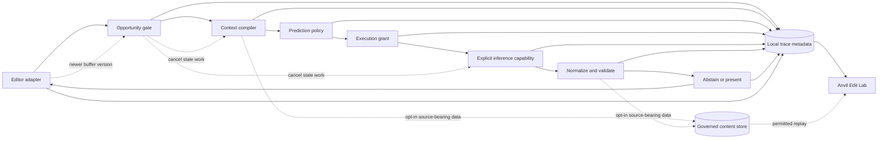
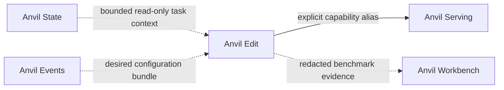
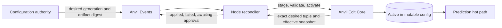

# Architecture

Status: **proposed foundation**

Last reviewed: **2026-08-23**

## System shape

Anvil Edit has one hot path and one evidence path. They share versioned domain
contracts but have different latency and data-retention requirements.



The diagram does not imply that content is persisted. Context and candidates
may remain memory-only. Source-bearing persistence requires a separate grant.
`AUTH` runs before content is serialized for another process or trust domain.

## Components

### Editor adapter

Translates editor-native state and events into versioned snapshots, receives
presentation decisions, re-checks version fences, applies only user-approved
edits, and emits outcome observations.

The adapter is responsible for portable `DocumentRevision` construction:
workspace and document incarnation, logical URI scheme, editor-native version,
position encoding, line-ending/canonicalization rules, range semantics, and
full-buffer digest. It must expose capabilities such as inline preview,
multi-range diff, next-location focus, conditional application, and
cancellation instead of pretending all editors support the same interaction.

The v0 application boundary is a single-document conditional transaction. A
future multi-document adapter must prove atomic compare-and-apply or declare an
explicit one-document-at-a-time review flow.

### Opportunity gate

Uses cheap local signals to decide whether a snapshot warrants work. It owns
debounce, duplicate suppression, trigger classification, explicit reveal, and
the first abstention point.

The gate must run without model inference. Its decisions are versioned policy
and measurable independent of downstream candidate quality.

### Context compiler

Selects a bounded prefix/suffix, recent edits, visible or recently visited
regions, semantic references, diagnostics, and optional task context. Every
selected item has an inclusion reason, digest, token cost, and permission
class.

Retrieval is a policy choice. “Available in the repository” does not mean
“included in every request.”

### Prediction policy

Chooses whether to request inference, which explicit capability and native
prompt protocol to use, whether a request is visible or shadow-only, and what
deadline/output budget applies.

The first implementation uses one visible fast capability. Races and semantic
escalation are introduced only after shadow evidence shows incremental value.

### Authorization engine

Compiles the effective repository, workspace, destination, capture-purpose,
and local-session controls into an `ExecutionGrant`. It runs after context
selection identifies the prospective content classes but before the protocol
adapter serializes source for dispatch.

Context selection itself runs only inside a pre-resolved local runtime-read
grant. The content-bound dispatch grant then binds the selected digests/classes
to a destination before serialization. Neither step may borrow authority from
the other.

The policy model is deliberately finite rather than an open-ended DSL: deny
rules union, allowlists intersect, minimum retention wins, local pause wins,
fleet configuration may narrow but never widen local permission, and unknown
inputs fail closed. Runtime read, dispatch, persistence, replay, export,
training, shadow use, task context, and outcome correlation are independent
grants.

### Protocol adapter

Converts a `ContextPack` to a model-native request and converts native output
to a candidate draft. Protocol identity and revision are first-class benchmark
inputs. Comparing Zeta-style rewriting, Sweep-style rewriting, and FIM without
recording their different protocols is not a model-only comparison.

### Inference executor

Executes the exact requested capability. It may be Anvil Serving or a local
standalone endpoint. It exposes cancellation and timing/identity evidence when
available. It does not choose “a better model” on the caller's behalf.

### Candidate normalizer and validator

Parses native output, computes explicit edits, rejects invalid or overlapping
ranges, checks source versions/digests, enforces scope, and records syntax or
diagnostic results.

Validation can prove shape, freshness, and selected static properties. It
cannot by itself prove that the edit matches developer intent.

All model and protocol output is hostile input. The normalizer applies byte,
nesting, edit-count, replacement-size, and time bounds; rejects unsupported
control or bidirectional characters according to policy; checks protected
content and secrets without logging matches; and emits plain normalized edits.
Raw model markup is never rendered or executed.

### Display policy

Chooses `show` or `suppress` and an interaction mode under the remaining
deadline. It owns confidence thresholds, duplicate suppression after
generation, and restrained/subtle presentation policy.

### Trace writer

Appends metadata and governed content references without blocking the editor
hot path. Backpressure drops or degrades optional telemetry before it delays a
prediction. Dropped evidence is counted and surfaced.

### Anvil Edit Lab

Replays pinned opportunities, invokes competing protocol/model/policy
configurations, joins shadow and visible outcomes, and produces immutable
benchmark and promotion manifests.

Lab is not allowed to reinterpret missing content or executor identity as a
successful deterministic replay.

## Request sequence

1. The editor emits a snapshot with portable document revision `v`.
2. The opportunity gate emits or suppresses an opportunity.
3. Under a local runtime-read grant, the context compiler proposes a bounded
   context pack for `v` and labels application-critical, display-critical, and
   advisory dependencies.
4. Prediction policy records a `DispatchDecision` for one explicit capability
   and protocol.
5. The authorization engine compiles an `ExecutionGrant` for the destination,
   purpose, mode, and content classes before serialization.
6. The protocol adapter serializes only granted content and dispatches one
   request with relative deadline budgets.
7. A newer relevant editor snapshot invalidates `v` and signals cancellation.
8. Native output is bounded, normalized, and validated against `v`.
9. The display policy makes a show/suppress decision before the deadline.
10. The adapter records a presentation attempt after re-checking the target
    revision and display-critical dependencies.
11. A user gesture creates a conditional application attempt against the exact
    expected revision.
12. Human outcomes and censor-aware survival observations append to the local
    trace.

Steps 7, 10, and 11 are all required. Best-effort cancellation is a resource
optimization; the final fence is the correctness control.

## Latency budget

End-to-end render time is decomposed into:

```text
trigger delay
  + snapshot/capture
  + context selection and tokenization
  + dispatch and queue
  + prefill / TTFT
  + decode
  + normalization and validation
  + editor render
```

Every segment must be observable with monotonic durations. Tail latency and
stale work matter more than a single average. The policy may terminate a
request before its model output budget is exhausted when the render deadline
can no longer be met.

## Trust boundaries

Every deployment inventory distinguishes:

- editor UI host and user principal;
- adapter process or extension host;
- Core process and authorization principal;
- metadata and governed-content store host;
- executor host, operator, and destination trust domain; and
- Lab/replay host and reviewer principal.

Co-location does not erase these boundaries. The implementation threat model
must define peer authentication for IPC, transport encryption where data
crosses a host/process trust boundary, key creation/storage/rotation/recovery,
backup and sync behavior, and source exposure through crash dumps, swap, temp
files, telemetry, and logs. Remote dispatch remains disabled until the
destination grant and peer identity can be proven before serialization.

Protected-input filtering happens after logical URI and path resolution so a
symlink, alternate URI scheme, workspace mount, or case-folding difference
cannot bypass repository policy.

## Data stores

The foundation requires logical separation, not a chosen database library:

### Metadata journal

Immutable-during-retention lifecycle objects, timings, policy identities, and
outcome observations. It should support local concurrency, bounded writes,
authorized erasure, export, and deterministic materialized views. Purpose-
scoped identifiers avoid a default cross-repository identity graph.

### Governed content store

Optional source-bearing snapshots, context items, native outputs, and accepted
edits. It requires repository allowlisting, finite retention, deletion,
encryption appropriate to the threat model, and content-addressed integrity.

Content addressing is scoped to a repository/purpose by default; global
deduplication would create a cross-repository correlation surface. Deletion
must remove source blobs, linkable metadata, derived indexes, and declared
backup/export copies, then report failures. A minimal deletion receipt cannot
retain a content digest or stable session/repository identifier.

### Derived benchmark store

Rebuildable summaries, metric tables, and reports. Aggregate results must point
back to a manifest and never become the only copy of the underlying evidence.

SQLite/WAL plus content-addressed blobs is a plausible implementation, not yet
an accepted decision. If selected, the threat model and deletion tests must
cover WAL pages, free pages, `secure_delete` behavior, checkpoints, vacuuming,
temporary files, and backups rather than assuming row deletion erases bytes.

## Failure behavior

| Failure | Required behavior |
| --- | --- |
| Execution grant denied, expired, or incomplete | Abstain before serialization; record non-source denial evidence |
| Context retrieval fails | Continue only with an explicitly valid smaller context policy or abstain |
| Selected capability unavailable | Record failure; no hidden substitute |
| Cancellation unsupported upstream | Discard late output through the version/deadline fence |
| Protocol parse fails | Record invalid candidate; never render raw model text as an edit |
| Protected input or output detected | Remove only through a recorded smaller-context policy or abstain; never echo the protected bytes |
| Trace store slow or unavailable | Preserve editor operation; report evidence loss/degradation |
| Outcome attribution ambiguous | Record ambiguity or `attribution_lost`; do not guess |
| Raw-content policy denies persistence | Keep permitted runtime data ephemeral and store metadata/digests only |
| Policy revision missing | Fail closed for reproducible replay; do not use an unpinned latest policy |
| Edit and executor evidence disagree | Preserve both claims, mark the join conflicted, and fail dependent promotion gates |
| Deletion misses a store, backup, or export | Report partial failure and keep the deletion request actionable; never claim erasure completed |
| Events is unavailable | Make no hot-path call; retain the permitted last verified snapshot or remain disabled in managed mode |
| Desired configuration is stale, conflicting, incomplete, or incompatible | Do not activate it; retain the prior verified snapshot and report the exact reason |
| Configuration activation crashes | Mark the attempt indeterminate and inspect Core's exact active identity before recovery |
| Configuration verification or rollback fails | Do not report the desired generation applied; preserve the conflict/failure for explicit recovery |

## Evidence seam

The executor or Anvil Serving owns resolved model/tokenizer/runtime/
quantization/hardware identity, queue/prefill/decode timing, capacity, and
executor termination. Edit owns opportunity selection, context and protocol
policy, normalization, TTRS, stale/deadline behavior, presentation,
application, survival, cohorts, and Edit-policy promotion.

One canonical request correlation identifier joins both records into a pinned
manifest. Missing evidence is explicit. Conflicting observations are retained
and block any gate whose conclusion depends on the disputed value.

## Sibling integrations



- State is optional context, not telemetry storage.
- Events distributes immutable desired configuration, not live editor events.
- Serving executes a named capability, not semantic routing.
- Workbench is an optional evidence and approval surface, not a hot-path
  dependency.

No integration authorizes a deployment. Source changes, configured aliases,
running endpoints, live editor acceptance, and policy promotion are distinct
evidence states.

### Future Anvil Events control path

The Events integration is a design reference and is not implemented. In
managed mode, a background reconciler may fetch and validate one exact
`edit/config/<channel>` bundle, then ask Core to atomically activate it through
an authenticated local control boundary. Core's prediction path reads only the
already-active immutable snapshot; it never calls Events, JetStream, an
artifact source, or a reconciler while producing a prediction.



One bundle is the first atomic activation unit. Independently converged prompt,
policy, protocol, or capability resources are deferred until an activation-
group contract prevents mixed generations. Fleet configuration is source-free
P0 data and cannot create an `ExecutionGrant` or widen local privacy settings.
Crash recovery verifies Core's exact active identity before resolving an
indeterminate reconciliation. See
[`integrations/anvil-events.md`](integrations/anvil-events.md).

## Adapter portability validation

The first adapter must exercise snapshot through application and survival in
one editor. A second-editor spike produces a capability matrix for:

- document incarnation/version/digest and position encoding;
- event sequencing and cancellation;
- inline, diff, reveal, and next-location presentation;
- single-document conditional application;
- presentation/application/outcome attribution; and
- local IPC and destination authorization boundaries.

An OpenAI-compatible or model-provider integration establishes executor
compatibility only. Missing lifecycle capabilities narrow the supported-editor
claim; adapters never synthesize evidence the editor does not expose.

## Deployment shapes

### Standalone local

Editor, Core, trace store, Lab, and one inference endpoint run on one machine.
This is the simplest privacy and latency baseline.

### Local network

Editor and Core run near the user; explicit inference capabilities run on one
or more private GPU nodes. Core owns deadlines and policy. Transport must be
authenticated and no broader than the private deployment boundary.

### Managed private fleet, later

Desired model/policy revisions converge to private nodes and aggregate evidence
is reviewed centrally. Raw source-bearing traces remain developer-controlled
unless a separate, explicit governance policy changes that boundary.

Private host names, addresses, active route assignments, and operator overlays
do not belong in this public architecture.
