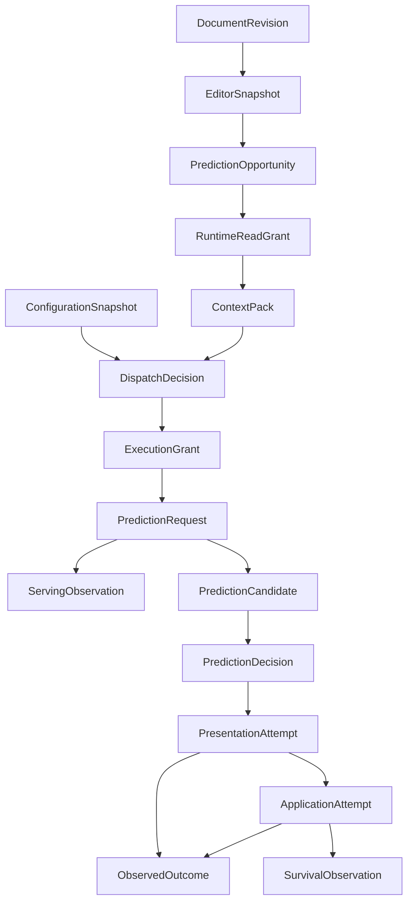

# Semantic data model

Status: **implemented foundation model; wire and persistence formats open**

Last reviewed: **2026-08-24**

This is a developer map of the Rust semantic model in
`anvil-edit-contracts`. [`CONTRACTS.md`](CONTRACTS.md) remains the normative
authority for lifecycle meaning and invariants. If this map and that contract
disagree, the contract wins and the Rust types must be corrected.

## Three independently versioned layers

Anvil Edit deliberately separates three things that are often called “the data
model”:

| Layer | Current state | Authority |
| --- | --- | --- |
| Semantic domain model | Implemented as Rust contract types at semantic version `0.2` | `docs/CONTRACTS.md` and `anvil-edit-contracts` |
| Cross-process wire model | Not selected | O003 in `docs/DECISIONS.md` |
| Durable metadata/content stores | Not selected | O003, O004, and the implementation threat model |

The Rust layout is not a wire ABI. A future JSON Schema, Protobuf, or other
encoding must preserve the semantics and pass language-neutral fixtures. A
database must have its own schema version, migrations, export path, retention,
and physical-erasure tests.

## Aggregate map

| Aggregate | Primary types | Owns |
| --- | --- | --- |
| Identity and causality | `RecordEnvelope`, `ProducerPosition`, `RecordCorrelation`, `Provenance` | Producer sequence, monotonic clock identity, wall-time correlation, causal parents, supersession, idempotency, purpose-scoped session/repository IDs |
| Configuration | `ConfigurationSnapshot`, `ConfigurationIdentity`, `ConfigurationComponent`, configuration observations | Complete immutable component set, local policy digest, standalone/managed provenance, activation evidence |
| Editor state | `DocumentRevision`, `EditorSnapshot`, `TextRange` | Exact document incarnation/version/digest, position and line-ending semantics, cursor/visible state |
| Context | `RuntimeReadGrant`, `ContextPack`, `ContextItem`, `ContentReference` | Separate pre-context read authority, selected content handles, reasons, token/byte totals, exact source revisions, freshness roles |
| Dispatch and authorization | `DispatchDecision`, `ExecutionGrant`, `PredictionRequest`, `AttemptIdentity` | Explicit capability choice, content-bound destination authority, relative budgets, cancellation and retry/race/fallback relations |
| Executor evidence | `ServingObservation` | Resolved model/runtime identity and queue, TTFT, decode, cache, and terminal observations when known |
| Candidate and UI | `PredictionCandidate`, `PredictionDecision`, `PresentationAttempt`, `ApplicationAttempt` | Bounded normalized edits, show/suppress policy, actual render evidence, user-authorized conditional application |
| Outcomes | `ObservedOutcome`, `SurvivalObservation` | Attribution, partial use, undo/rewrite/save/commit proxies, censor-aware survival |
| Journal union | `LifecycleRecord`, `RecordKind` | Keeps every durable record role distinct without selecting serialization |

## Lifecycle relationships

Arrows are causal references, not mutable foreign-key state transitions. A
record is append-only during its authorized retention. Corrections use
`supersedes`; duplicate delivery uses `idempotency_key`; out-of-order delivery
retains evidence rather than inventing missing records.

## Source-bearing content boundary

Durable semantic records contain `ContentReference`, never source bytes. A
content reference records:

- a purpose-scoped identifier;
- the finite purpose scope in which that identifier is meaningful;
- digest and byte length;
- privacy data class; and
- permitted persistence class.

Buffer text, logical URI bytes, context snippets, native prompts and model
output, and replacement text remain behind the authorized runtime or governed
content-store boundary. Even an in-memory content handle does not authorize
another process to resolve it. Runtime read and executor dispatch remain
separate grants.

The content digest can still correlate or reveal guessable material across
records; purpose-scoping the identifier does not make that digest anonymous.
P4 protected content can only be represented as memory-only. This is defense in
depth; a caller must still apply protected-path and secret policy before the
data reaches a model or store. Digests and opaque identifiers are governed
metadata, not anonymization.

## Critical structural invariants implemented now

- Semantic major-version incompatibility fails closed.
- Producer sequences start at one; causal parents are unique and cannot point
  to the record itself.
- A complete `ConfigurationSnapshot` contains exactly one of every required
  component and keeps managed desired provenance separate from active identity.
- A `DocumentRevision` carries editor/workspace/incarnation identity, version
  namespace, position encoding, line ending, terminal newline,
  canonicalization, half-open range semantics, full-buffer length and digest.
- Downstream revision references repeat the exact source-free fencing semantics
  so out-of-order consumers do not need an immediately available join.
- Context token and byte totals must equal their selected items.
- Initial and retry/race/fallback/escalation attempt shapes cannot be confused.
- Runtime read and executor dispatch are separate immutable records. A granted
  dispatch binds the exact content handles/classes, and shadow dispatch also
  requires its independent shadow permission.
- Valid candidate edits are source-bearing handles against one exact base
  document, cannot overlap, and use explicit base-relative list ordering.
- The v0 application record can represent only one-document conditional
  application and cannot report partial atomic success.
- Policy choice, serving evidence, candidate validity, show decision, actual
  presentation, application, outcome, and survival remain distinct record
  kinds.

These are structural guarantees. They do not prove that an editor rechecked a
revision, a transport serialized zero bytes after denial, a model is deployed,
or a suggestion was useful. Those claims require Core behavior and the evidence
levels in [`EVALUATION.md`](EVALUATION.md).

## Still intentionally unresolved

- JSON Schema, Protobuf, or another wire encoding;
- local IPC framing, peer authentication, and destination attestation;
- generated bindings for editor or Lab languages;
- journal database and governed content-store formats;
- migration, export, backup, and byte-erasure procedures;
- maximum parser, collection, and payload sizes at each trust boundary; and
- multi-document atomic application.

Those choices must not be inferred from Rust enum discriminants, field order,
`Debug` output, or memory representation.
